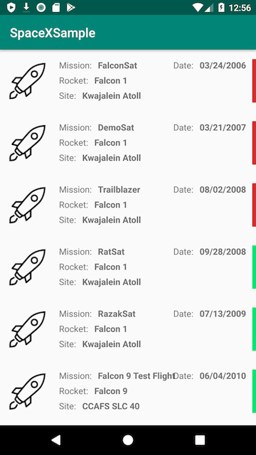

# SkeletonSpaceXApp
Mobile Android app that interacts with the public SpaceX APIs



# Useful References

### Retrofit
https://square.github.io/retrofit/  

### SpaceX Data 
https://api.spacexdata.com/  
https://status.spacexdata.com/  
https://docs.spacexdata.com/?version=latest  

### Picasso
https://square.github.io/picasso/  

# Core Project Dependencies

```
// Google Gson
implementation 'com.google.code.gson:gson:2.8.5'

// Square Retrofit HTTP Library - https://square.github.io/retrofit/
implementation 'com.squareup.retrofit2:retrofit:2.5.0'
implementation 'com.squareup.retrofit2:converter-gson:2.5.0'
implementation 'com.squareup.okhttp3:okhttp:3.12.0'
implementation 'com.squareup.okhttp3:logging-interceptor:3.11.0'

// Square Picasso
implementation 'com.squareup.picasso:picasso:2.71828'
```

# Business Requirements Document (BRD)

```
// TODO: Add requirements / screen mocks
```
